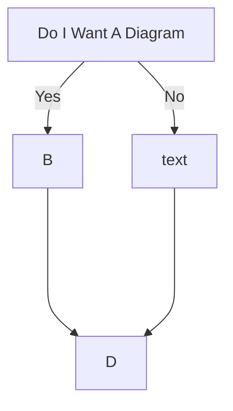

# Creating .md Diagrams with Mermaid




```mermaid
      graph LR
      A[]-- Yes -->B;
      A[Do I Want A Diagram]-- No -->C[text];
      B---->D;
      C---->D;
```

## Explanation

graph TD = graph top down
graph LR = graph left right


'''https://mermaid-js.github.io/mermaid/#/flowchart'''


