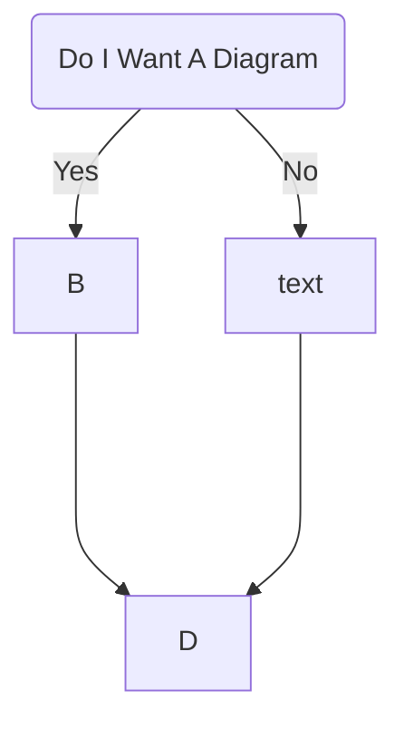
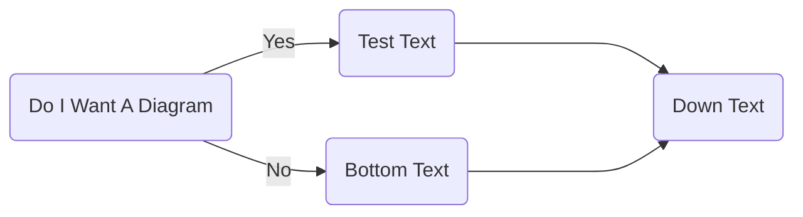

# Creating .md Diagrams with Mermaid

```mermaid
  graph TD;    
      A[Do I Want A Diagram]-- Yes -->B;
      A(Do I Want A Diagram)-- No -->C[text];
      B---->D;
      C---->D;
```

```mermaid
      graph LR
      A(Do I Want A Diagram)-- Yes -->B;
      A(Do I Want A Diagram)-- No -->C(Bottom Text);
      B(Test Text)---->D(Down Text);
      C(Bottom Text)---->D(Down Text);
```

## Explanation

> graph TD = graph top down  
>  graph LR = graph left right

'''https://mermaid-js.github.io/mermaid/#/flowchart'''

